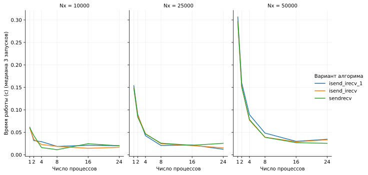

# ДЗ3
Студент: Aleksandre Beloff

Сделаны задачи 1-4. Реализован синхронный вариант (с `MPI_Sendrecv`) и 2 немного разных асинхронных варианта (с `MPI_Isend/MPI_Irecv`). Начальное условие и получившеся решение отправляются/собираются на 0 процессе с остальных через `Gather` и `Scatter`.

Компиляция
```bash
bash make.sh
```
Появится бинарник `main_mpi`.

Запуск первого задания через srun (с параметрами T=0.1, Nt=501, Nx=51):
```bash
bash run_task1.sh
```

Выыедет много всего, в том числе
```
...
maxAbsErr=0.0360803
...
```

Это отклонение численного значения от формулы.

=== тут будет сравнение графиков численного решения и формульного ===

## Масштабируемость (задача 2)


В 2 задании написано взять T=10^-4, но тогда шаг по времени tau=0.0002 получается больше чем конечный момент времени T. Поэтому я взял tau поменьше.

```bash
bash run_task2_more_Nt.sh
```

Запустит через sbatch, будет много файлов вывода, которые обрабатываются в `task2.ipynb` и строится график:


